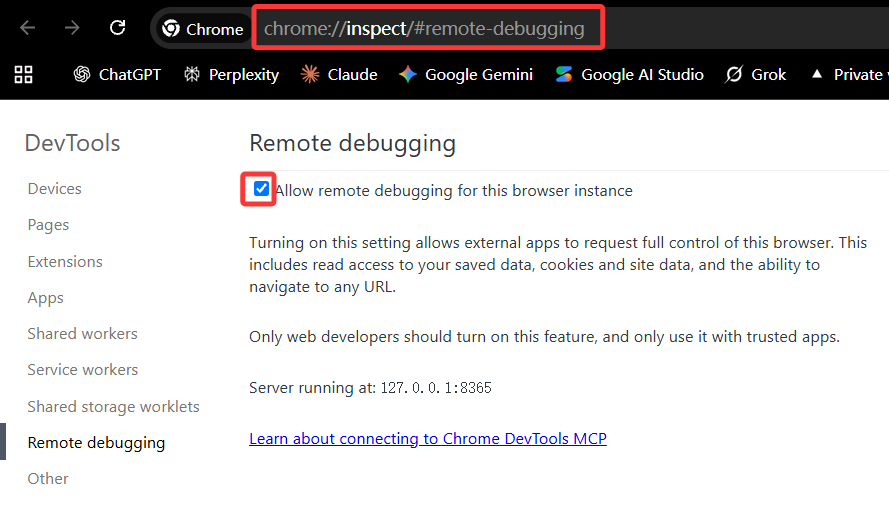
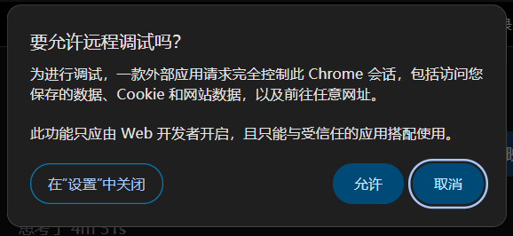

# Alibaba Buyer Due Diligence


本地 Alibaba 每日客户背调 Skill，`0.2.0-rc.3`。包含后台自动采集：每日建档客户列表 → 客户详情 → 买家主页 → 私有 v3 JSON/XLSX → 公开背调 → 全量研究、总报告、矩阵、观察池及合格匹配客户 PDF。也保留已有每日导出文件输入模式。**采集必须使用原生 Chrome DevTools；没有数据上传或数据库连接功能。**

当前检查与剩余边界见 [本地验收记录](VALIDATION.md)。

已知限制：真实全流程测试尚未通过。买家主页采集中已复现：站点为本地接收器请求追加查询参数后，接收器路由返回 404；该兼容性问题仍待修复。当前以候选版公开，不代表生产验收通过。

Python 校验阶段顺序与产物；Codex 负责公开检索和判断；可选 Hooks 提醒并拦截能够识别的越级调用。没有模型运行框架、爬虫服务或任务队列。

## 安装和运行

验收平台：Windows，Python 3.13。采集需要 Node.js（使用内置模块，无 npm 安装）、宿主提供的原生 Chrome DevTools MCP 工具及已经登录的 Alibaba Chrome 会话；不依赖浏览器扩展。PDF 需要本机 Chrome/Edge 和中文字体。依赖版本锁定，不打包浏览器和字体。

### 浏览器准备与运行时配合

1. **执行前，开启 Chrome 远程调试。** 在已登录 Alibaba 的 Chrome 中打开 `chrome://inspect/#remote-debugging`，勾选 **Allow remote debugging for this browser instance**，如下图。这里的开发者调试设置指原生远程调试开关，不是扩展页面的“开发者模式”，无需安装浏览器扩展；图中的端口仅为示例。

   

2. **执行 skill 时，留意授权弹窗并点击“允许”。** Codex 通过原生 Chrome DevTools 请求连接时，如出现下图“要允许远程调试吗？”弹窗，请确认是当前任务发起、来自可信应用的请求后，点击 **允许**。远程调试可控制浏览器并访问保存的数据、Cookie 和网站数据，不要批准不明来源的请求。

   

3. **采集期间，随时配合完成滑动验证。** 请保持能够操作浏览器并留意 Codex 提示。遇到滑动验证码时，暂停采集，由你在浏览器中手动完成验证，再告知 Codex 继续；skill 不自动破解或绕过验证码。恢复前须重新核验当前会话和采集状态，按恢复流程只处理未成功的客户，不跳过验证、不反复盲目重试，也不将验证失败视为零客户或采集完成。

### 运行命令

```powershell
python -m venv .venv
.venv\Scripts\python -m pip install -r requirements.txt
# 默认采集北京时间昨天建档的全部客户：
.venv\Scripts\python -X utf8 scripts\workflow.py collect --workspace <working-directory>
# 或者只处理已有导出，不重复采集：
.venv\Scripts\python -X utf8 scripts\workflow.py init --input <daily.json> --xlsx <daily.xlsx> --workspace <working-directory>
.venv\Scripts\python -X utf8 scripts\workflow.py next --run <run-directory>
.venv\Scripts\python -X utf8 scripts\workflow.py advance --run <run-directory>
.venv\Scripts\python -X utf8 scripts\workflow.py finalize --run <run-directory>
```

`collect` 和 `init` 二选一。`advance` 一次只推进一个阶段；缺证据返回非零。缺视觉验收时先生成 PDF 并停留，查看后补回执再执行。所有路径相对脚本或显式参数，不依赖旧插件或开发者机器。

采集前完整读取 [采集契约](references/collection-contract.md) 与 [原生浏览器接入](references/native-browser.md)。Python 负责进度、接收、校验和导出，页面脚本必须通过原生 Chrome DevTools 调用当前会话的只读 Alibaba API；不是一个脱离浏览器就能运行的爬虫。不初始化 browser-client、不先尝试扩展，也不在原生失败后回退扩展或手动 Console。工具缺失、权限冲突或连接失败时停止并报告。不能承诺所有 Codex 配置都无人值守；登录、验证码和原生授权交由用户。

```powershell
.venv\Scripts\python -X utf8 scripts\workflow.py receiver --run <run-directory> --kind list
# 用原生 DevTools evaluate_script 在已登录的客户通执行返回的 devtoolsFunctionFile；不要打印一次性凭据。
.venv\Scripts\python -X utf8 scripts\workflow.py receiver-status --run <run-directory> --kind list
.venv\Scripts\python -X utf8 scripts\workflow.py receiver-stop --run <run-directory> --kind list
.venv\Scripts\python -X utf8 scripts\workflow.py advance --run <run-directory>
# 按 next 依次完成 detail、链接核对、profile、导出和研究。
```

可选 `--dictionary <私有字典>`；缺字典保留 unresolved，不硬编码作者账号业务员。大于 5000 条需要当前账号核实且含未分配客户的 `--sales-map`；缺映射、单段仍超限或覆盖数量不符会停止。接收器只绑定本机、校验来源及一次性凭据；失败后先检查会话，再显式 `--resume-after-review`，只处理未成功客户。正常停机清理自己的临时凭据文件，业务及错误记录保留。

成功 API 明确返回零客户时签发 `completed_no_customers`，后续阶段标为不适用；网络失败、缺 total 或登录失效绝不能冒充零客户。采集六阶段完成后继续同一 run 的七个研究阶段，不会把“采集完成”误报为“全流程完成”。

## 故障诊断

```powershell
.venv\Scripts\python -X utf8 scripts\workflow.py diagnose --run <run-directory> --signal devtools_failed
# 多个仍未解决的观察可重复 --signal，例如 --signal captcha。
```

诊断只读、保留所有观察，不自动重试或更改阶段；停止建议退出码为 2。只有原生连接调用实际失败才记录 `devtools_failed`；无法定位的错误用 `unknown_failure`，不能靠手选信号证明根因。CIM/进程查询故障不等于 DevTools 故障。登录/验证码/风控优先停止采集；本地缺行、未解决错误与验证失败也不能跳过。旧定时任务的 DevTools/AHK 授权不自动转移。

### 必需的原生 Chrome DevTools 通道

原生 DevTools 是唯一采集通道，不是扩展失败后的备用分支。当前任务授权与宿主许可已经核实后，直接进行原生预检：

```powershell
.venv\Scripts\python -X utf8 scripts\workflow.py diagnose --run <run-directory> --devtools-authorized --host-allows-devtools
```

两个参数只记录已经成立的条件，不授予权限。未核实原生条件时诊断停止，不导向扩展；更高优先级的宿主限制仍须遵守，有冲突就报告，不自行修改全局技能。诊断返回 `CHECK_AUTHORIZED_DEVTOOLS` 后，使用当前工具目录中的 `list_pages`、`select_page`、`evaluate_script` 核验连接和页面；原生远程调试弹窗默认由用户确认。接收器的 `devtoolsFunctionFile` 适配函数式页面执行接口；连接与页面检查不代替真实 API 校验。

可选 `browser-helper inspect/start/stop` 支持已有的、用户审阅并单独授权的 Windows AHK 辅助程序，按当前 run/PID/启动时间/文件哈希核验，只处理自己确认身份的进程。不打包、下载或默认启动自动点击器，不硬编码作者机器路径。CIM 不可用时直接用限定范围的 `Get-Process`；身份不明则停止，不误杀/替换。命令和授权边界见接入说明。连接成功不等于采集或背调完成，仍须通过原有 13 阶段。

将仓库根目录安装/链接为 Codex 的 `skills/alibaba-buyer-due-diligence`，以 `$alibaba-buyer-due-diligence` 调用。开发时建议目录链接到唯一源码，不维护两份副本。发现行为以当前 Codex 版本为准。不要改变旧技能或每日任务，切换需显式选用新技能。

默认产物位于工作区 `outputs/<sourceDate>/<runId>/`。`--out` 仅改变基础目录，日期和唯一运行 ID 仍会追加。原始文件只读；私有真实产物禁止提交。详细规则见 [输入契约](references/input-contract.md) 和 [研究契约](references/research-report-contract.md)。

## Codex Hooks

```powershell
.venv\Scripts\python -X utf8 hooks\codex_guard.py --install <working-directory> --python <absolute-python.exe>
```

合并工作区 `.codex/hooks.json`，保留其他 Hooks；不更改全局配置、不写信任记录。`hooks/codex_hooks.example.json` 只是跨平台示意，安装命令生成实际路径。更新 Python/仓库路径或处理器定义后重新检查。

随后使用 Codex 原生 `/hooks` 检查并信任精确的定义；项目配置层也必须被信任。没有原生信任和实测，不称“已启用”。[官方 Hooks 文档](https://learn.chatgpt.com/docs/hooks) 说明了信任、工具覆盖、code-mode 嵌套调用和失败行为。

初始化读取真实 `CODEX_THREAD_ID`，或显式给 `--session-id`。绑定同时核对会话、规范化工作区和 runId；其他会话/无绑定直接返回。多个活动候选会报告歧义，不选最近一个。

四种事件：SessionStart 提示恢复位置；PreToolUse 对明确指向当前运行的过早 PDF/finalize 或修改完成状态的补丁拒绝执行；PostToolUse 重新验证产物；Stop 最多自动补做同一缺口两次。用户暂停/取消/外部阻塞允许结束。PostToolUse 无法撤销已经发生的写入。

支持工具的直接载荷单测不等于宿主触发：正式启用需在隔离合成运行分别验证 Shell、apply_patch、code-mode 内部调用的拒绝、PostToolUse 失效处理、SessionStart 恢复、Stop 续跑、并发及无绑定隔离。记录实际事件；未测的标为未测。宿主不调用、未信任、超时或损坏输出可能失败开放，但 Python `finalize` 仍会拒绝缺证据完成。

这是过程与产物校验，不是对可任意写文件的攻击者的防篡改系统，也不能从一份手写检索笔记证明现实事实真实。不能承诺“AI 永不漏步”。

## 测试与全虚构样例

```powershell
python -X utf8 -m unittest discover -s tests -p "test_*.py" -v
python -X utf8 tests/test_screen_uk_sanctions.py
python -X utf8 examples/synthetic_demo.py --out outputs/synthetic-demo
```

所有样例从零构造，使用显式 SYNTHETIC 标记和示例域名，不是脱敏真实客户。演示到视觉门禁为止，不伪造人工看图通过。测试默认离线；PDF 检查使用本机浏览器。英国名单 CLI 要求 Windows Job Object，其他平台明确拒绝不受保护的执行。

## 来源、许可证和发布边界

- 新写的独立映射、Python 工作流与 Hooks；XLSX 和输入校验共用唯一 26 字段投影。
- 采集页面脚本、列表字典转义、v3 源装配及诊断分类源自用户维护的 `alibaba-inquiry-crm` 插件版本 `0.1.0+codex.20260724124439`。维护者已明确允许采集器代码随本 skill 开源；迁移移除了账号业务员映射、机器路径、后台上传与下游任务依赖。源码收在本仓库 `scripts/collection/`，运行时不访问旧插件。新接收器采用 Python 标准库，并增加来源/身份/大小/恢复校验。
- PDF 生成器、固定样式及英国名单扫描器/回归检查源于用户维护的 `nanyue-deep-due-diligence` 基线 `fbbe26b0df7ee972dc6e13466109ca5e37656746`，本地迁移时去掉旧演示数据和上传相关功能；原仓库未附根许可证，外部发布前维护者应确认这些自有材料的可授权性及版权署名。当前 MIT 是拟发布许可，不能替代该确认。
- 内嵌 Phosphor 图标保留 [第三方 MIT 声明](assets/THIRD_PARTY_NOTICES.md)。依赖由包管理器安装，不随仓库重新分发；未复制商业字体。
- 公开发布前检查 `git ls-files`、暂存差异、完整提交历史、忽略规则和来源许可；确认仓库归属及发布权限。真实运行目录、会话/绑定文件不进 Git。当前候选版本不自动推送或创建公开仓库。

## 联系方式

微信：`thl6139421`
